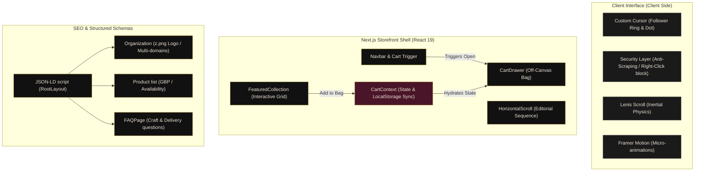

# Maison ZIRUVA | Platform Prototype

> **Paris Aesthetic. Indian Soul.**  
> *Designed in London, UK · Handcrafted by Master Artisans in Italy.*

Welcome to the digital atelier of **ZIRUVA**, a luxury leather goods maison built on the principle of *True Scarcity*. Every silhouette in our catalog is conceived through refined geometric design in London, realized via 128 meticulous steps of traditional Italian craftsmanship, and retired permanently once sold out.

This repository contains the Next.js 16 storefront prototype for Maison ZIRUVA, implementing a premium editorial design system, interactive micro-animations, smooth inertial physics scrolling, and structural schema SEO.

## ✦ Platform Architecture & Flow



---

## ✦ Design System & Brand Identity

ZIRUVA's visual experience is defined by quiet, confident silence—restricting color palettes, extending typography tracking, and avoiding generic UI patterns to project exclusivity.

### Luxury Color Palette

| Token | Hex Value | Application |
| :--- | :--- | :--- |
| **Primary Noir** | `#0A0A0A` | Main page background (subtle texture overlay) |
| **Secondary Noir** | `#111111` / `#1A1A1A` | Card backdrops, inputs, footer |
| **Luxury Gold** | `#C9A84C` | Borders, interactive states, accent typography |
| **Ivoire** | `#F2EBE0` / `#EDE4D6` | Primary reading text, custom line drawings |
| **Bordeaux** | `#4A1528` | Announcement bar background, special alert tokens |
| **Pierre (Stone)** | `#8C8075` | Captions, metadata, secondary interface labels |

### Typography Guidelines

- **Serifs (Headings)**: `Cormorant Garamond` (Weights: 300, 400, 500)
- **Sans-Serifs (Body & UI)**: `Montserrat` (Weights: 200, 300, 400, 500)
- **Tracking (Spacing)**: High letter-spacing (3px to 6px) applied to uppercase headers to emphasize rarity and poise.

---

## ✦ Core Technical Architecture

Built using the latest modern React and Next.js APIs:

*   **Next.js 16 (App Router)**: Exploys server/client component boundaries for optimal performance.
*   **React 19**: Utilizes modern hook cycles, state management, and provider updates.
*   **Tailwind CSS 4**: Utilizes PostCSS compilation with modern grid layouts and custom color configurations.
*   **Framer Motion**: Powering fluid entrance transitions, fade-ups, and interactive hover states.
*   **Lenis Scroll**: Implements smooth inertial scrolling with high-performance RAF bindings.

---

## ✦ Curated UI Components

Located within `src/components/`, these custom modules create the signature luxury digital experience:

1.  **`CustomCursor.tsx`**  
    A customized client-side cursor consisting of a delayed 32px gold-dusted ring (`border: 1px solid rgba(201, 168, 76, 0.5)`) tracking a central 8px gold dot. The ring expands and shifts color during interactive hover states.
2.  **`SecurityLayer.tsx`**  
    Protects original luxury assets and high-fidelity product renderings by intercepting global right-clicks and stopping image drag-and-drop operations.
3.  **`LoadingScreen.tsx`**  
    A custom preloader featuring editorial text transitions and percentage progress metrics, acting as a gateway that blocks scroll interactions until page assets are ready.
4.  **`CartDrawer.tsx`** & **`CartContext.tsx`**  
    An off-canvas cart manager linked to React context, enabling smooth slide-ins, real-time total updates, and localized items tracking.
5.  **`FeaturedCollection.tsx`**  
    Allows users to filter by product line (Hero, Signature, Limited), view variant swatches, and trigger details panels with structural specs.
6.  **`HorizontalScroll.tsx`**  
    Translates vertical mouse/trackpad scrolls into horizontal slides showcasing large-scale product editorial photographs and text stories.

---

## ✦ Structured Schema & Search Engine Optimization (SEO)

Maison ZIRUVA is prepared for organic visibility through comprehensive semantic layout structure:

*   **JSON-LD Linked Data**: Fully configured in `src/app/layout.tsx` incorporating:
    *   `Organization` schema containing branding, founding dates, and multi-domain linkages (`ziruva.co`, `ziruva.uk`, `ziruvaofficial.com`).
    *   `WebSite` structure defining global search endpoints.
    *   `FAQPage` listing common questions concerning craftsmanship, origins, and delivery.
    *   `ItemList` mapping to structured `Product` schemas including currencies (`GBP`), shipping rates, and limited availability indicators.
*   **Sitemap & Metadata**: Includes a dynamically managed sitemap (`src/app/sitemap.ts`) and full OpenGraph/Twitter Cards settings for social preview optimization.

---

## ✦ Project Directory Layout

```bash
├── public/                # Static assets, branding files, and SVG designs
└── src/
    ├── app/               # Next.js pages & router
    │   ├── checkout/      # Multi-step checkout pipeline
    │   ├── collection/    # Collection overview page
    │   ├── how/           # Craftsmanship process and "how we build"
    │   ├── product/       # PDP (Product Detail Pages)
    │   ├── layout.tsx     # Root shell, HTML templates, and JSON-LD scripts
    │   └── page.tsx       # Homepage dashboard with smooth-scroll hooks
    ├── components/        # Custom UX blocks (Hero, Navbar, Footer, etc.)
    ├── context/           # CartContext providers and state wrappers
    ├── data/              # Structured product specifications database
    └── hooks/             # Custom window sizes and scroll monitors
```

---

## ✦ Development Lifecycle

### Prerequisites
Make sure you have Node.js (v18+) and npm/pnpm installed on your system.

### 1. Installation
Clone the repository and install the development dependencies:
```bash
npm install
```

### 2. Run the Development Server
Launch the local Hot-Module-Replacement (HMR) environment:
```bash
npm run dev
```
Open [http://localhost:3000](http://localhost:3000) inside your web browser.

### 3. Production Build
Prepare the project bundle for live deployment:
```bash
npm run build
```

### 4. Code Quality & Linting
Run ESLint to check for stylistic errors or code smells:
```bash
npm run lint
```
